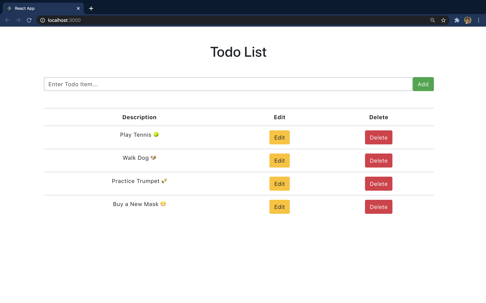

# pern-todo
This is an interactive, full-stack web application todo list built with ReactJS on the client side, Express and Node.js on the server side, and a PostgreSQL relational database. The user can add an item, make changes or delete the item. All changes update dynamically on the page and persist in a hidden database.

I made this application to teach myself how to create full-stack web applications that integrate with a relational database. A nice byproduct was learning about the ReactJS Bootstrap framework, which made life much simpler on the front-end. 

## example

## details
### Server Side
The backend makes use of Node.js, a JavaScript runtime environment, with an Express framework. Express allowed me to easily set up a server. I wrote five HTTP routes to create a todo (post), get all todos (get), get a specific todo (get), update a todo (put), and delete a todo (delete). I also set up a PostgreSQL table to store the todo list items. 

### Client Side
The frontend, built with ReactJS and Bootstrap, makes use of two primary components: InputTodo and ListTodos, the latter of which branches into displaying, editing, and deleting. These components were written as functional components with state hooks. The bulk of the work on the client side involved calling the relevant API route upon click of a button to add, edit, and delete an entry. To display the list, I mapped the database entries to a table display. 

### Moving Forward
A few extensions that I might pursue:
- Make this a default browser landing page.
- Display items in order of priority (user provides date/time deadline or priority ranking). 
- Add an expandable description field for each item.

### Credit
Credit goes to The Stoic Programmers for their online tutorial.
